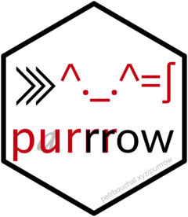

<!-- README.md is generated from README.Rmd. Please edit that file -->

```{r, include = FALSE}
knitr::opts_chunk$set(
  collapse = TRUE,
  comment = "#>",
  fig.path = "man/figures/README-",
  out.width = "100%"
)
```

# purrrow <a href='http://petrbouchal.xyz/purrrow'></a>

<!-- badges: start -->
[](https://www.tidyverse.org/lifecycle/#experimental)
[](https://github.com/petrbouchal/purrrow/actions)
[](https://github.com/petrbouchal/purrrow/actions)
<!-- badges: end -->

The goal of purrrow is to provide out-of-memory data collation into Arrow datasets. 

It provides a set of functions with a logic similar to purrr, except that the result is an arrow dataset on disk. Each of these functions iterates the function passed to `.f` over `.x` and builds an arrow dataset on disk that contains all the data returned by `.f` as it iterates over `.x`.

For a primer on Arrow datasets and how to work with them in dplyr, see the [vignette](https://cran.r-project.org/web/packages/arrow/vignettes/dataset.html) in Arrow (`vignette('dataset', 'arrow')`).

This has two advantages:

1. it is shorthand compared to building and manually writing and then collating a bunch of arrow datasets
2. compared to using `purrr::map_dfr()` followed by `arrow::write_dataset()`, you do not need to have all the data in memory at one time; the binding into one dataset happens out of memory.

As in `{purrr}`, the functions come in multiple flavours, with a suffix indicating the output:

- `marrow_dir`: returns the directory in which the resulting dataset is stored (which is also its `.path` param)
- `marrow_ds`: returns an arrow `Dataset` object
- `marrow_files`: returns paths to all the files in the arrow dataset. This can be useful for tracking the files in make-like workflows, e.g. `{targets}`.

## Installation

This is not yet on CRAN. You can install the development version from [GitHub](https://github.com/) with:

``` r
# install.packages("remotes")
remotes::install_github("petrbouchal/purrrow")
```

## Getting started

The basic logic is as follows:

1. pass a function as the .f argument to 

## Examples

```{r}
library(purrrow)
```


```{r}
months <- unique(airquality$Month)
part_of_mpg <- function(month) {
  airquality[airquality$Month==month,]
}
```


```{r}
td <- file.path(tempdir(), "arrowmp")
aq_arrow_dir <- marrow_dir(.x = months, .f = part_of_mpg,
                           .partitioning = "Month",
                           .path = td)
```

```{r}
library(arrow)
open_dataset(aq_arrow_dir)
```


```{r}
td <- file.path(tempdir(), "arrowmp2")
aq_arrow_ds <- marrow_ds(.x = months, .f = part_of_mpg,
                         .partitioning = "Month",
                         .path = td)
aq_arrow_ds
```


```{r}
td <- file.path(tempdir(), "arrowmp3")
aq_arrow_files <- marrow_files(.x = months, .f = part_of_mpg,
                               .partitioning = "Month",
                               .path = td)
aq_arrow_files
```


```{r}
library(dplyr)
all_equal(aq_arrow_ds %>% collect(), airquality)
```


## Caveats and limitations

- no map2 and pmap equivalents yet
- unlike purrr's map functions, purrrow's marrow functions do not return an output of the same length as .x. This is intentional.
- currently only Hive-style partitioning is supported [TO DO]
- there is currently no way to pass further arguments to `arrow::write_dataset()` [TO DO]
- unlike Arrow's `write_dataset()`, `marrow_*()` functions do not infer partitioning from grouping in the dataset returned by .f. This is intentional so as not to introduce confusion in the partitioning.
- .f must provide the column which differentiates the rows returned by each iteration over .x - i.e. there is no equivalent to `purrr::*_dfr()`'s `.id` parameter yet [TO DO]
- Note that arrow will happily write files for a new/differently partitioned dataset into the same directory, so you must take care to clear out/delete a directory before writing an arrow dataset into it.
